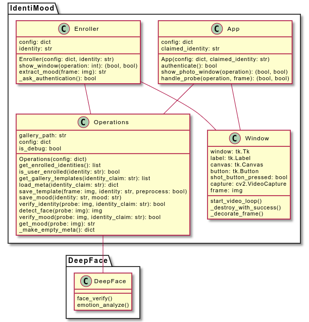

# IdentiMood

IdentiMood is an authentication system based on **face verification** and **mood recognition**, which has been developed as final project for the **Biometric Systems course** at Sapienza University of Rome, held by **Prof. Maria De Marsico** (2021-22).

* [Project report](docs/identimood-report.pdf)
* [Project presentation](docs/identimood-presentation.pdf)

## How it works

### Enrollment

### Verification

### Use case example

## Running example

## System design

## Evaluation

The evaluation can be reproduced by executing the scripts in the `benchmarks` directory.

See the report/presentation for further information and detailed results.

## How to run

1. Install the requirements from `requirements.txt`.
2. Tweak `src/config.json` as desired.
3. Execute `src/enroll.py` to perform enrollment.
4. Execute `src/main.py` to authenticate.

## Authors

* [Daniele Solombrino](https://github.com/DS98)
* [Davide Quaranta](https://github.com/fortym2)
* [Emanuele Volanti](https://github.com/emavola)

